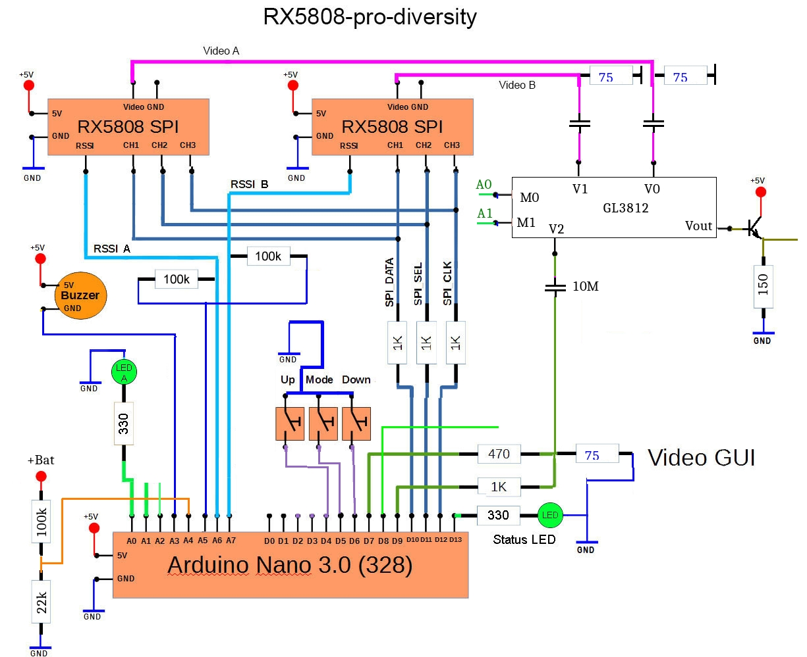

#DIY Simple - Arduino Nano

####BOM
- 4x 1k resistor
- 1x 470 resistor
- 3x 330 resistor
- 3x 75 resistor
- 1x GL3812 video switch
- 1x 150 resistor
- 1x NPN transistor
- 3x 10uF capacitor
- 2x rx5808 receiver with [spi mod](rx5808-spi-mod.md)
- 3x LEDs
- 3x Momentary switch
- 1x Toggle switch
- 1x Buzzer (optional)
- 1x 4066 digital switch chip
- 1x Arduino Nano 3.0 328

####Schematic

